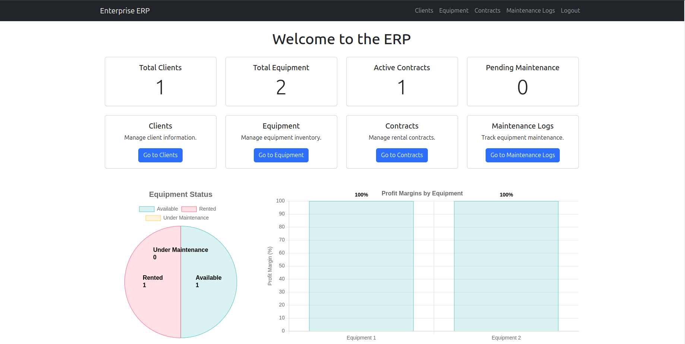

# ERP System for Rental



This is a simple ERP (Enterprise Resource Planning) system designed for Rental enterprises. The system allows users to manage clients, equipment, contracts, and maintenance logs.

## Features
- **Client Management**: Add, edit, and view client info.
- **Equipment Management**: Track equipment availability and status.
- **Contract Management**: Manage rental contracts and track payments.
- **Maintenance Logs**: Record and track equipment maintenance.
- **Financial Statistics**: View profit margins and outstanding payments.

## Technologies Used
- **Backend**: Laravel (PHP)
- **Frontend**: Blade Templates, Chart.js
- **Database**: MySQL

## Installation

### Prerequisites
- PHP 8.0 or higher
- Composer
- MySQL
- Node.js and npm (for frontend assets)

### Steps
1. **Clone the repository**:
    ```bash
    git clone https://github.com/your-username/ERP-Rental.git
    cd ERP-Rental
2. **Install PHP dependencies**:
    ```bash
    composer install
3. **Install JavaScript dependencies**:
    ```bash
    npm install
    npm run dev
4. **Create a *.env* file**:
    ```bash
    cp .env.example .env
    Update the *.env* file with your database credentials and other settings.
5. **Generate an application key**:
    ```bash
    php artisan key:generate
6. **Run migrations to set up the database**:
    ```bash
    php artisan migrate
7. **Seed the database (optional)**:
    ```bash
    php artisan db:seed
8. **Start the development server**:
    ```bash
    php artisan serve
9. **Access the application in your browser**:
    ```bash
    http://localhost:8000

## Usage

- **Home Page**: View quick stats and access different modules.
- **Clients**: Manage client information.
- **Equipment**: Track equipment inventory and status.
- **Contracts**: Manage rental contracts and payments.
- **Maintenance Logs**: Record and track equipment maintenance.